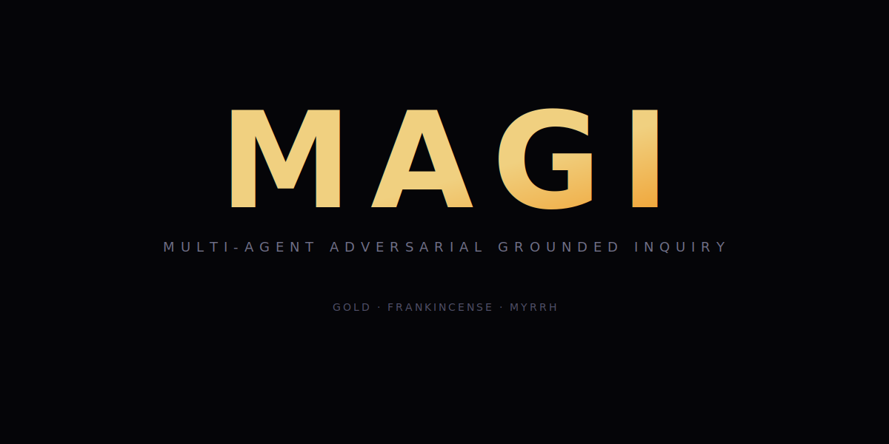

# MAGI (マギ) · Hermes Agent Protocol

**Triadic independent inquiry protocol.**

MAGI is a Hermes Agent Protocol for comparing independent perspectives before
adopting a conclusion. It is not a mixture-of-agents answer aggregator. Its
primary output is a convergence/divergence residual: what three independently
formed perspectives can and cannot jointly support. Model choices, third-party
tools, delegate identities, and fixed role assignments are intentionally
unbound here.

## What Is MAGI?

MAGI defines a triadic review shape:

- independent perspectives enter separately
- each perspective states evidence and uncertainty
- convergence is treated as a signal, not proof
- divergence is preserved instead of hidden

Any concrete implementation must bind its own models, tools, authorization
boundaries, logging, and failure handling outside this repository before use.

MAGI's portable artifact is a residual trace: a record of what converged, what
diverged, what evidence was present, and what remains unresolved.
Action-relevant traces should include `trial_manifest` so convergence is tied
to declared perspectives, perturbation axes, independence controls,
contamination risks, and cost. HIGHBALL may consume that trace if MAGI output
is later used near an action boundary.
The trace must follow RASHOMON `schemas/residual-trace.schema.json`.
Historical MAGI archives may predate this contract. They should be scanned for
adoption, not rewritten merely to improve metrics.
Follow-up outcomes are host artifacts. If later command, runtime, source,
human-review, or external evidence confirms or contradicts a MAGI trace, the
host records that in a HIGHBALL outcome ledger. MAGI must not self-certify its
own downstream success.

## Frame

MAGI is useful when a decision benefits from three independent lines of
inspection rather than a single narrator. The protocol does not require the
three perspectives to have fixed names, tools, models, or standing roles.

## Convergence Gate

Converge when independent perspectives materially agree. Adopt the shared
claim only with its evidence.

Diverge when perspectives disagree or evidence is incomplete. Preserve the
disagreement and avoid false closure.

No weighting, no scoring, and no authority outside MAGI's own convergence gate.

MAGI does not close high-risk operational findings by itself. If a conclusion
touches protected code, protocol, money movement, deployment, or other
irreversible action, the trace should preserve the issue as open or escalated
for HIGHBALL, QUINTE, direct evidence, or human review.

## Implementation

This repository contains the protocol contract an implementation may
instantiate. It does not choose the implementation's model lineup.

Project references:

- [specs/PROTOCOL.md](specs/PROTOCOL.md) is the canonical protocol specification.
- [skills/SKILL.md](skills/SKILL.md) is the framework reference skill.

Cultural and naming material is context only. It must not define routing,
fallback, voting authority, or authorization.

## License

MIT — the protocol and orchestration layer.
