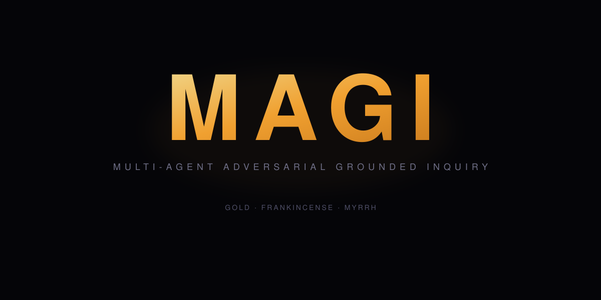

<div align="center">



# MAGI

**A container-isolated CLI for triadic cross-family verification**

[](specs/PROTOCOL.md)
[](docs/runtime.md)
[](docs/containers.md)
[](LICENSE)

</div>

MAGI produces a final technical decision from three independently formed,
cross-checked seat products. It is designed for high-stakes work where one
model family, one review procedure, or a simple vote is not a sufficient
review boundary.

MAGI is not a generic agent swarm. It owns a closed workflow: three immutable
Hermes execution profiles, three isolated containers, three distinct model
families, three complete QUINTE dossiers, six directed cross-reviews, one
Final Adjudicator, and one deterministic product verifier.

## Design Vocabulary

MAGI keeps three kinds of diversity separate:

- **Configuration diversity:** specification, failure-analysis, and
  evidence-validation profiles apply different review procedures to the same
  brief.
- **Model-family diversity:** MiMo, DeepSeek, and OpenAI provide three distinct
  foundation-model families. A different prompt or profile does not create a
  different model family.
- **Execution isolation:** each seat has a private container, network,
  credential, profile tree, state tree, and artifact tree. Isolation limits
  state leakage; it does not prove statistical independence or truth.

Inside each seat, QUINTE remains strictly single-family: Party A-E, the
Counterpart Arbiter, and the Primary Arbiter all use the seat's declared
family/provider/model binding. Cross-family verification happens only at the
MAGI layer.

## Runtime Boundary

The production pipeline is fixed:

1. Three frozen Hermes profiles produce independent analyses before any
   exchange.
2. Each seat runs one complete, same-family QUINTE review.
3. MAGI freezes each thesis, profile, evidence boundary, and QUINTE product as
   a digest-bound dossier.
4. Each original seat reviews both other anonymized dossiers through its same
   frozen profile and container, producing six directed reviews.
5. A declared Final Adjudicator emits `PASS`, `BLOCK`, or `ESCALATE`.
6. A deterministic verifier rejects missing high-risk findings, invented
   evidence, severity downgrades, unsupported closure, hidden dissent, replay,
   binding drift, incomplete reviews, or an unsafe `PASS`.

The final product is not a majority vote and not a residual-text merge. It is
an actionable conclusion with dissent and provenance preserved. MAGI supplies
evidence to an outer control plane; it does not authorize a deployment, write,
payment, deletion, or other protected action.

## Production Lineup

| Seat | Review profile | Family / provider | Runtime carrier |
| --- | --- | --- | --- |
| `seat-m` | specification | MiMo / Xiaomi | native `mimo` CLI |
| `seat-d` | failure analysis | DeepSeek / DeepSeek | native `reasonix` CLI |
| `seat-g` | evidence validation | OpenAI / configured relay | native `codex` CLI |

OMP, CodeWhale, OpenCode, Kilo, Claude, desktop clients, and GUI consoles are
outside the production carrier allowlist. There is no silent fallback from one
seat family to another.

## Quick Start

MAGI is display-independent and intended for local terminals, SSH sessions,
and other headless callers. The stable sources are this repository, QUINTE,
and the private Hermes technical rules selected on the host.

```bash
# Verify the local runtime and locked sources.
MAGI_PROFILE_PYTHON="$HOME/Private/agent-design/hermes/agent/.venv/bin/python" \
  scripts/host/diagnose.sh
scripts/host/build-image.sh

# Initialize one immutable trial.
bin/magi init /absolute/trials/example \
  --trial-id example-001 \
  --brief /absolute/brief.json \
  --seat seat-m --seat seat-d --seat seat-g \
  --action-boundary protected_write

# Build three dossiers, run six reviews and final adjudication, then replay
# deterministic verification. Production config generation is documented in
# docs/runtime.md.
bin/magi build-dossiers /absolute/trials/example --config builders.json
bin/magi run /absolute/trials/example --config agents.json
bin/magi verify-product /absolute/trials/example
```

Resume with the same commands and the same frozen configuration. A changed
runtime, builder configuration, agent configuration, dossier, review, verdict,
or trace fails closed instead of creating a mixed-history product.

## Evidence and Provenance

The original Brief `1.1` remains digest-bound. Selected evidence is staged into
a private trial tree and exposed read-only to the relevant seat; source files
are never modified. Evidence coverage records what was staged, hashed,
presented as an image or derived frame, cited by a resulting artifact, and left
unreviewed.

An exposed file is not automatically a reviewed file. MAGI reports uncited or
uninspected media as an explicit limitation. Video review uses deterministic
frame extraction rather than silently claiming full-motion coverage.

Product Summary `1.0` binds:

- the original brief, action scope, and action binding;
- all three family/profile/model/QUINTE products;
- all six reviewer identities, frozen profiles, execution receipts, and review
  artifacts;
- the declared Final Adjudicator identity and execution receipt;
- the final verdict, exact dissent, and deterministic residual trace.

`verify-product` reloads and revalidates the complete product. A trace by
itself is not a completed MAGI result.

## Containers and Platforms

One locked Linux image is reused with three different immutable seat bindings.
Seats run non-root with a read-only root filesystem, all capabilities dropped,
`no-new-privileges`, private tmpfs, read-only inputs, and provider-restricted
proxy egress.

- **macOS:** current locally verified execution target through Docker Desktop;
  provider secrets may be materialized temporarily from Keychain.
- **Linux:** native launcher and Docker Engine contract are supplied; real-host
  acceptance remains a Linux-host task.
- **Windows:** native PowerShell and Docker Desktop contract are supplied;
  real-host acceptance remains a Windows-host task.

No local emulation or CI job is described as Windows or Linux end-to-end
acceptance. Platform-specific setup and known pitfalls live with the matching
Hermes rules.

## Repository Contracts

- [Protocol specification](specs/PROTOCOL.md) defines the triadic invariants.
- [Runtime contract](docs/runtime.md) defines resume and product verification.
- [Container contract](docs/containers.md) defines profiles, secrets, mounts,
  networks, and host launchers.
- [JSON schemas](schemas/) define every model and product boundary.
- [MAGI skill](skills/SKILL.md) is the thin host entry point to the CLI.

MAGI emits the versioned RASHOMON Trace `1.1` data contract for interoperability.
The independent RASHOMON research project is not a runtime dependency.
HIGHBALL owns product routing, user authorization, and protected-write
enforcement.

## Verification

The local acceptance target is macOS:

```bash
PYTHONDONTWRITEBYTECODE=1 python3 -m unittest discover -s tests -v
MAGI_PROFILE_PYTHON="$HOME/Private/agent-design/hermes/agent/.venv/bin/python" \
  bash tests/host/test_static.sh
bash tests/host/test_proxy_topology.sh
git diff --check
```

The archived `poc/` material is historical mechanism evidence only. Its three
seats used one MiMo family, so it cannot establish cross-family benefit or a
universal confidence ceiling.

## License

MIT. Provider services, model runtimes, and host-bound tools retain their own
licenses and terms.
