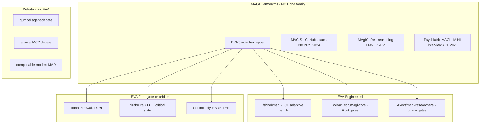

I'll verify each classified repo and cross-check the landscape claims against what's actually on GitHub and in this workspace.
# Landscape Analysis Audit: GitHub MAGI Projects

I verified the listed repos against GitHub READMEs, ACL Anthology entries, and the `fshiori/magi` codebase in this workspace. Below are specific findings by your five questions.

---

## 1. Missing GitHub MAGI Projects

**High-signal omissions (should have been in the landscape):**

| Project | Why it matters | Evidence |
|---------|----------------|----------|
| **[Axect/magi-researchers](https://github.com/Axect/magi-researchers)** | EVA-themed, production-grade multi-model pipeline with **phase gates**, adversarial debate, MAGI-in-MAGI scaling, Claude plugin | 152 commits; README documents "Phase gates — Automated quality checkpoints" and 6-phase research pipeline |
| **[TomaszRewak/MAGI](https://github.com/TomaszRewak/MAGI)** | Listed, but underweighted — **140 stars**, most popular pure EVA MAGI repo | GitHub API |
| **[fshiori/magi](https://github.com/fshiori/magi)** | **114 stars** — largest active engineered EVA MAGI system | GitHub API; this workspace |
| **[composable-models/llm_multiagent_debate](https://github.com/composable-models/llm_multiagent_debate)** | 538 stars; foundational multi-agent debate with MMLU evals; not MAGI-named but directly relevant to "debate tier" | README: ICML 2024, `./mmlu/` benchmark code |
| **[BolivarTech/magi-claude](https://github.com/BolivarTech/magi-claude)** + **[BolivarTech/magi-core](https://github.com/BolivarTech/magi-core)** | Rust/Python MAGI ecosystem; `magi-core` is a sibling of the listed crate, not duplicate | GitHub org has multiple MAGI repos |
| **[dinobby/MAgICoRE](https://github.com/dinobby/MAgICoRE)** | Listed as "MAGI-CORE" but repo is **`MAgICoRE`**, EMNLP 2025 | [ACL Anthology EMNLP 2025 #1660](https://aclanthology.org/2025.emnlp-main.1660/) |

**Secondary omissions (lower priority but real):**

- `nlink-jp/magi-system`, `eashwar18/magi-synth-vote`, `j33pguy/magi` (MCP memory server), `eric-stone-plus/MAGI` (dialectical spiral)
- **Psychiatric MAGI (Bi et al.)** — paper exists, **no prominent public GitHub** found; only author page [biguanqun.github.io](https://biguanqun.github.io/) lists the ACL 2025 paper

**Search methodology blind spot:** GitHub name search for "MAGI" misses high-star debate systems (`llm_multiagent_debate`, `agent-debate`) and homonym papers (MAGIS, MAgICoRE, MAGI-SLAM).

---

## 2. Misclassifications

### ACADEMIC tier

| Entry | Issue |
|-------|-------|
| **MAGI-CORE (EMNLP 2025)** | **Name wrong.** Correct name: **MAgICoRe**; repo: `dinobby/MAgICoRE`. Not Evangelion MAGI — multi-agent *reasoning refinement*. |
| **MAGI psychiatric (ACL 2025)** | **Venue imprecise.** It is **Findings of ACL 2025**, not main conference. **4 agents** (navigation, question, judgment, diagnosis) — not a 3-vote EVA system. |
| **MAD (first LLM debate, 2023)** | Repo is **`Skytliang/Multi-Agents-Debate`**, not "MAD". **"First" is contested** — repo self-claims it; [composable-models/llm_multiagent_debate](https://github.com/composable-models/llm_multiagent_debate) is also arXiv May 2023 (2305.14325 vs 2305.19118). |
| **MAGIS (NeurIPS 2024)** | Correct venue/task, but **homonym** — GitHub issue resolution, zero EVA connection. Should be flagged as acronym collision, not grouped with EVA MAGI semantically. |

### ENGINEERED tier

| Entry | Issue |
|-------|-------|
| **gumbel-ai/agent-debate** | **Not a MAGI project.** No Evangelion framing, no Melchior/Balthasar/Casper. It is a **markdown debate protocol** for coding agents. Belongs in a **"structured debate / code review"** bucket, not ENGINEERED MAGI. |
| **magi-core (Rust v0.3.0)** | **Version stale.** `BolivarTech/magi-core` README badges show **`magi-core = "1.0"`** on crates.io; v0.3/v0.4/v0.5 are historical. Has explicit **`complexity_gate`** — arguably more gate machinery than `fshiori/magi`. |
| **fshiori/magi** | Correct tier, but analysis underplays it: pip package `magi-system`, ICE critique, adaptive routing, bench CLI, NERV dashboard. |

### EVA FAN tier

| Entry | Issue |
|-------|-------|
| **CosmoJelly/MAGI-PROTOCOL** | Not pure 3-vote: has **4th ARBITER** synthesizer after parallel streaming. FastAPI+Next.js claim is **correct**. |
| **hirakujira/MAGI-System** | Undersold. Has **"Critical Matter" unanimous gate** (irreversible/catastrophic topics require 3/3 approve). That is real gate logic, not mere fan UI. **71 stars** vs CosmoJelly's **1 star**. |
| **lordpba/AI_Magi** | CrewAI **synthesis**, not majority vote — closer to "three perspectives → merge" than EVA voting. |
| **07JP27/MagiSystem** | Correct as C# .NET MAGI; uses `MajorityVoteAsync` — classification OK. |

### OTHER tier

| Entry | Issue |
|-------|-------|
| **just-every/magi** | Correct that it's not 3-vote EVA — but it **does have a supervisor** (`supervisor` agent in test harness). If QUINTE criteria include supervisor, this repo actually satisfies that. |
| **albinjal MCP debate** | Correct tier. Repo: `albinjal/multi-agent-debate-mcp`. **Flexible agent count** (pro/con/judge), not fixed-3. |

### Biggest tier error

**`Axect/magi-researchers` is ENGINEERED-tier material** (gates, multi-round debate, benchmarks, plugin distribution) but is **absent entirely**.

---

## 3. Factual Errors

### In the landscape analysis (verified wrong or unsupported)

1. **"MMLU benchmark claiming 83% = Sonnet with 3 cheap models"** — **Misleading / unsupported by committed artifacts.**

   - `BENCHMARK_UPGRADE.md` documents **7 MMLU questions total** (5 `abstract_algebra` + 2 `professional_law`), not full MMLU and not "Hell Mode" across three subjects.
   - Those 7 runs show MAGI **7/7 (100%)** and Sonnet **5/7 (~71%)** — not 83.3% for either side.
   - README claims **Formal Logic** as a third Hell Mode category, but **no `formal_logic` benchmark run exists** in repo docs or `experiments/results-2026-03-28.txt`.
   - The committed `experiments/results-2026-03-28.txt` is a **25-question builtin PoC** (not MMLU): Sonnet **76%**, MAGI critique **88%**.

2. **magi-core "v0.3.0"** — outdated; current published line is **v1.0**.

3. **MAD = "first LLM debate"** — attribution error. It is one early repo; "first" is marketing, not established fact.

4. **MAGI-CORE spelling** — should be **MAgICoRe** (`dinobby/MAgICoRE`).

5. **Psychiatric MAGI "ACL 2025"** — technically **Findings of ACL 2025** ([paper](https://aclanthology.org/2025.findings-acl.1278/)).

### In `fshiori/magi` marketing vs code (relevant to landscape claims)

- README headline **83.3% MMLU** is not reproducible from checked-in experiment logs.
- `BENCHMARK_UPGRADE.md` line 3 explicitly calls the 25-question builtin set **"概念驗證 (PoC)"** only.
- Agreement measurement in ICE is **word-overlap Jaccard**, with code comment: *"should be replaced with LLM-as-judge"* — weak theoretical grounding.

---

## 4. Blind Spots

### A. Homonym collision (critical)

At least **five unrelated "MAGI" acronyms** are conflated:

| Name | Meaning | Domain |
|------|---------|--------|
| EVA MAGI | 3 supercomputers, majority vote | Fan implementations |
| MAGIS | Multi-Agent GitHub Issue resolution | NeurIPS 2024 SWE |
| MAgICoRe | Multi-Agent Iterative Coarse-to-Fine Refinement | EMNLP 2025 reasoning |
| Psychiatric MAGI | Multi-Agent Guided Interview | ACL Findings 2025 clinical |
| MAGI-SLAM | Multi-Agent Gaussian SLAM | CVPR 2025 robotics |

The four-tier taxonomy **mixes these by name similarity**, which distorts "landscape of GitHub MAGI projects."

### B. Debate ≠ Vote ≠ Refinement

The analysis collapses:

- **Parallel vote** (hirakujira, TomaszRewak)
- **Parallel + arbiter synthesis** (CosmoJelly)
- **Multi-round critique** (fshiori ICE)
- **Coarse-to-fine refinement with RM gating** (MAgICoRe)
- **Markdown agent debate protocol** (gumbel)
- **Clinical interview tree navigation** (psychiatric MAGI)

These are different coordination topologies, not one "MAGI pattern."

### C. Popularity / maturity ignored

| Repo | Stars | Assessment |
|------|-------|------------|
| TomaszRewak/MAGI | 140 | Most starred EVA fan |
| fshiori/magi | 114 | Most engineered EVA fan |
| hirakujira/MAGI-System | 71 | Polished Next.js + safety gates |
| CosmoJelly/MAGI-PROTOCOL | 1 | Full-stack but tiny community |

Tier labels don't reflect adoption.

### D. Gate/supervisor patterns exist outside "ENGINEERED" label

Examples the analysis doesn't cross-compare:

- **hirakujira**: critical-matter unanimous rule
- **BolivarTech/magi-core**: `complexity_gate` predicate before LLM dispatch
- **gumbel agent-debate**: convergence + watch ledger gates (v0.7.0)
- **Axect/magi-researchers**: phase gates between pipeline stages
- **fshiori/magi**: adaptive agreement thresholds + vote→critique escalation

### E. QUINTE itself

**No GitHub repo or paper named "QUINTE"** appears in this MAGI landscape. Zero code-search hits. If QUINTE is an internal comparison rubric (supervisor + gates + theory), it cannot be validated as a peer project — only as a **design ideal**.

---

## 5. Is the fshiori/magi vs QUINTE Comparison Fair?

**Short answer: partially fair on benchmarks and theory; unfair or incomplete on gates and supervisor.**

| QUINTE claim | Verdict | Evidence |
|--------------|---------|----------|
| **"Benchmark is 7-question PoC, not full MMLU"** | **Fair and accurate** | `BENCHMARK_UPGRADE.md`: 5 + 2 MMLU questions; README overclaims "Hell Mode" across 3 categories with 83.3% |
| **"Lacks theoretical framework"** | **Fair** | No paper; ICE uses heuristic word-overlap (`critique.py` lines 34–38); `BENCHMARK_UPGRADE.md` still lists full MMLU integration as TODO |
| **"Lacks gate mechanisms"** | **Unfair / oversimplified** | `adaptive.py`: routes on agreement thresholds (0.8 / 0.4); `vote.py`: no-majority → auto-escalate to critique; fault-tolerance degradation paths in `engine.py`. These are gates — just not named "complexity_gate" like BolivarTech |
| **"Lacks supervisor"** | **Fair with nuance** | No 4th supervisor *agent* (unlike CosmoJelly ARBITER, psychiatric MAGI's 4 agents, or just-every's `supervisor`). But `Engine.ask()` **is** an orchestrator — the gap is architectural naming, not absence of coordination |

### Benchmark comparison fairness (deeper issue)

Even if QUINTE accepts fshiori's gates, the **83% MMLU claim should be rejected** as landscape evidence because:

1. Committed logs contradict it (builtin 25Q or 7Q MMLU subsets).
2. README uses **Claude Sonnet 4.6**; `BENCHMARK_UPGRADE.md` uses **Claude 3.5 Sonnet** — baseline inconsistency.
3. LLM-as-judge (`--use-judge`) can flip wrong extractions to "correct" — methodology not disclosed in README headline numbers.
4. Cherry-picked categories (abstract algebra, law) favor multi-agent cross-checking; not representative of full MMLU (~14k questions, 57 subjects).

### If QUINTE means "supervisor + formal gates + theory"

Then the **fair comparator** for fshiori/magi is not QUINTE (unverifiable) but concrete repos:

- **Supervisor + gates**: `Axect/magi-researchers`, `just-every/magi`, psychiatric MAGI paper
- **Gates without supervisor**: `BolivarTech/magi-core`
- **Theory + MMLU**: `composable-models/llm_multiagent_debate`, `Skytliang/Multi-Agents-Debate`, `dinobby/MAgICoRE`

Against those, fshiori/magi wins on **EVA fidelity + pip packaging + ICE critique + fault tolerance**; loses on **peer-reviewed theory, evaluation scale, and explicit supervisor/phase-gate architecture**.

---

## Corrected Mental Model

---

## Bottom Line

The landscape analysis is **directionally useful** but has **four systematic problems**:

1. **Homonym mixing** (MAGIS / MAgICoRe / psychiatric MAGI / EVA MAGI treated as one species).
2. **Missing high-quality engineered repos** (`Axect/magi-researchers`, underranking `fshiori/magi` and `TomaszRewak/MAGI`).
3. **Accepting fshiori's 83% MMLU headline** without checking artifacts (7-question PoC is the defensible critique).
4. **Misplacing non-MAGI debate tooling** (`gumbel-ai/agent-debate`) in ENGINEERED MAGI.

The **QUINTE comparison is fair on benchmark puffery and missing formal theory; unfair on gate mechanisms; accurate on missing a dedicated supervisor agent** — though that depends on whether QUINTE means a 4th LLM arbiter vs. an orchestration engine, which `fshiori/magi` already has.
