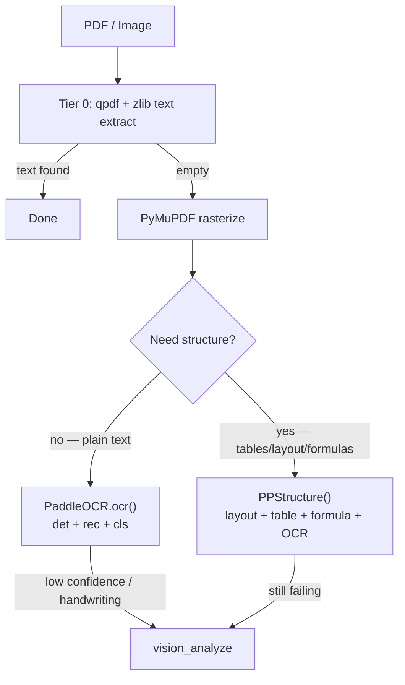

I'll locate the PaddleOCR skill and deployment docs, then verify how `PaddleOCR` and `PPStructure` are actually wired in this repo.
Verifying the installed PaddleOCR API to confirm the correct split between `PaddleOCR` and `PPStructure`.
Implementing the PaddleOCR / PPStructure split across the four files.
## Correct Architecture

PaddleOCR 2.10.0 exposes **two separate classes** with different model graphs. They share `~/.paddleocr/whl/` but must not be conflated.

| | `PaddleOCR` | `PPStructure` |
|---|---|---|
| **Purpose** | Line OCR (default Tier 1) | Document structure analysis |
| **Method** | `.ocr(img)` | `.__call__(img)` |
| **Loads** | det + rec + cls | layout + table + formula + det/rec |
| **Output** | `[[bbox], (text, conf)]` per line | Regions: `type`, `bbox`, `res` (HTML / LaTeX / OCR lines) |
| **Flags** | `lang`, `use_angle_cls`, `enable_mkldnn` | above + `table`, `layout`, `formula` |
| **Cold start** | ~0.8s | ~3–6s |

**The bug**: `table=True, layout=True, formula=True` on `PaddleOCR()` is a **no-op**. Those kwargs land on the params namespace via `**kwargs`, but `PaddleOCR.__init__` only downloads det/rec/cls — it never initializes `layout_predictor`, `table_system`, or `formula_system`. Verified: `PaddleOCR(..., table=True)` → `layout_predictor=False`; `PPStructure(..., table=True)` → all three systems present.

**PPStructure quirk**: It does not auto-download the cls model. With `use_angle_cls=True`, you must pass `cls_model_dir='~/.paddleocr/whl/cls/ch_ppocr_mobile_v2.0_cls_infer'` (PaddleOCR init downloads it; PPStructure does not).

## Routing Rule

- **Default**: `PaddleOCR.ocr()` — certificates, plain scanned text, batch throughput
- **Escalate**: `PPStructure()` — when you need table HTML, layout regions, or LaTeX formulas
- **Last resort**: `vision_analyze` — handwriting, semantic understanding

## Files Fixed

1. **`invocation-mac-intel-x86.md`** — Full two-engine split with constructors, singletons, result parsing, failure modes
2. **`SKILL.md`** — Decision tree, capabilities, batch template (`get_ocr()` + `get_structure()`, no bogus flags on `PaddleOCR`)
3. **`setup_paddleocr_mac.sh`** — Verify step inits both engines correctly; echo templates split line OCR vs structure
4. **`paddleocr-deployment.md`** — API table + verify one-liner corrected

Verify one-liner passes on your venv (both engines init OK in ~7s).

**Note**: `memories/MEMORY.md` and `memories/POSTMORTEM.md` still reference the old wrong pattern (`table/layout/formula` on `PaddleOCR`). Want those updated too?
